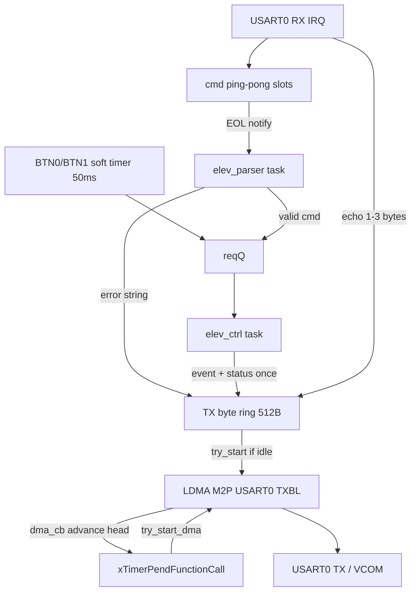
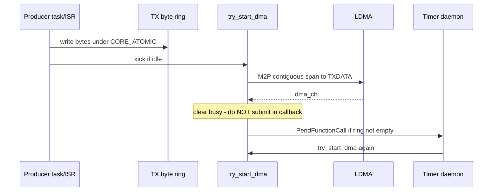
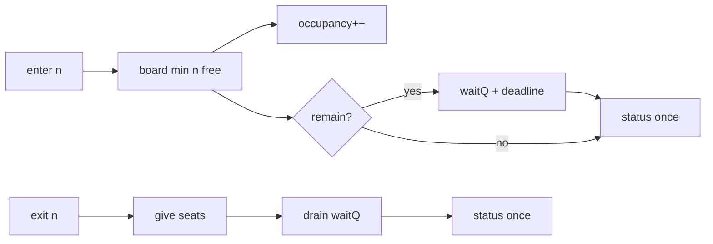

# Elevator Capacity Controller — Architecture Document

**Target:** EFR32xG24B / FreeRTOS (Simplicity SDK)  
**Board:** BRD4187C + WSTK (VCOM)  
**Policy:** Partial board + FIFO wait remainder (never reject a valid enter for capacity)

## End-to-end data flow



**Tasks:** `elev_parser` + `elev_ctrl` only. No dedicated UART TX FreeRTOS task.

## Components

| Component | Context | Role |
|-----------|---------|------|
| UART RX ISR | IRQ | Char collect, EOL, echo into TX ring, notify parser; backspace + up-arrow recall |
| `elev_parser` | Task | Validate line → `reqQ` or TX error string |
| `elev_ctrl` | Task | Occupancy, `sem_capacity`, `waitQ`, partial board, wait timeout, stats; prints event + **status once** on enter/exit/capacity |
| `elev_tx` | Service (no task) | Byte ring + LDMA owner; producers write; DMA-done defers next kick |
| Soft timer | Timer svc | BTN0/BTN1 poll (50 ms) only — **no periodic status timer** |

## UART TX path (ring + LDMA)



| Detail | Value |
|--------|-------|
| Buffer | `ELEV_TX_RING_SIZE` = 512 (power-of-2; one slot left empty) |
| Kick | `try_start_dma()` from producer context when idle |
| Continue | `dma_cb` advances `head`, clears busy, **pends** next kick (avoids submit-inside-callback stall) |
| Wrap | One contiguous DMA to end of buffer; next kick starts at index 0 |
| APIs | `elev_tx_print`, `elev_tx_enqueue`, `elev_tx_enqueue_echo_from_isr` |

## Status UX

| Event | UART output |
|-------|-------------|
| Idle / typing | Echo only — **no** auto status |
| BTN enter/exit or CLI `enter` / `exit` / `capacity` | Action line + **one** `handle_status()` dump |
| CLI `status` | Status once on demand |
| CLI `stats` / `help` | As requested |

Periodic 10 s status timer was removed so mid-line typing is not interrupted.

## FreeRTOS primitives

| Primitive | Symbol | Purpose |
|-----------|--------|---------|
| Task notification | ISR → parser | Command complete (EOL) |
| Queue | `reqQ` | Parser / button → `elev_ctrl` |
| Queue | `waitQ` | Remainder counts + deadline ticks |
| Counting semaphore | `sem_capacity` | Free seats (init = MAX; resizable) |
| Mutex | `mtx_state` | Occupancy + stats |
| Software timer | btn | Button debounce poll (50 ms) |
| Timer pend from ISR | TX | Deferred `try_start_dma` after LDMA complete |

**Removed vs older design:** `tx_task`, `tx_q` message queue, periodic status timer.

## Capacity algorithm

```
board = min(n, free)
take board seats (non-blocking)
if remain > 0: waitQ.push({remain, now + timeout})
on exit: give seats, then drain waitQ with free seats
on tick: drop waitQ items past deadline
```



## GPIO map — instrumentation (mandatory, BRD4187C)

| Pin | Event | Type |
|-----|-------|------|
| PC00 | RX ISR | Pulse |
| PC01 | Command complete | Pulse |
| PC02 | Parser active | Level |
| PC03 | Elevator active | Level |
| PC04 | Entry blocked (waitQ) | Level |
| PC05 | Sem give | Pulse |
| PC06 | Sem take | Pulse |
| PC07 | LDMA TX active | Level |
| PD02 | LDMA TX complete | Pulse |

## GPIO map — onboard UI (BRD4187C)

| Pin | Role | Type |
|-----|------|------|
| PB02 | LED0 — capacity available | Level (active-high) |
| PB04 | LED1 — full (solid) / deferred (blink ~250 ms) | Level (active-high) |
| PB01 | BTN0 — `exit 1` | Input (active-low) |
| PB03 | BTN1 — `enter 1` | Input (active-low) |

LED rules: LED0 ON when free seats > 0; LED1 solid when full and not waiting; LED1 blink when deferred wait non-empty.

## Console commands

| Command | Action |
|---------|--------|
| `enter <n>` | Board up to free seats; remainder deferred; print status once |
| `exit <n>` | Exit passengers; drain waitQ; print status once |
| `capacity <n>` | Resize max (1..32); reject if &lt; occupancy+waiting; print status once |
| `status` | Occupancy / free / waiting |
| `stats` | Totals entered/exited, deferred, timeouts, max occupancy |
| `help` | Command list |

Also: backspace/DEL edits the line; up-arrow recalls last command.

## VCOM

USART0: PA08 TX, PA09 RX @ **115200 8N1**; board enable PB00.

| Direction | Mechanism |
|-----------|-----------|
| RX | Byte IRQ (`USART_IF_RXDATAV`); ping-pong command slots — no LDMA |
| TX | Byte ring + LDMA M2P (`SL_DMA_SIGNAL_USART0_TXBL`) |

## Init order (`elev_app_init`)

1. GPIO + UART HW  
2. `reqQ`  
3. `elev_tx_init` (ring + LDMA channel)  
4. `elev_ctrl_init` / `elev_parser_init`  
5. Start parser + ctrl tasks; wire RX → parser notify  
6. Start button soft timer  
7. Banner via `elev_tx_print`  
8. Enable UART RX IRQ  

## Project slots

| Path | Contents |
|------|----------|
| `elevator/` | All hand-written elevator modules |
| `tests/` | Host-side parser unit test (not linked into firmware) |
| `docs/` | Architecture / design notes |
| `config/` | Editable SLC configs |
| `autogen/` | Studio-generated — never hand-edit |
| root `app.c` | Thin shim → `elev_app_init()` |
